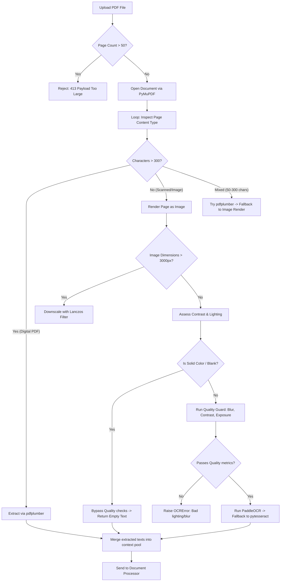
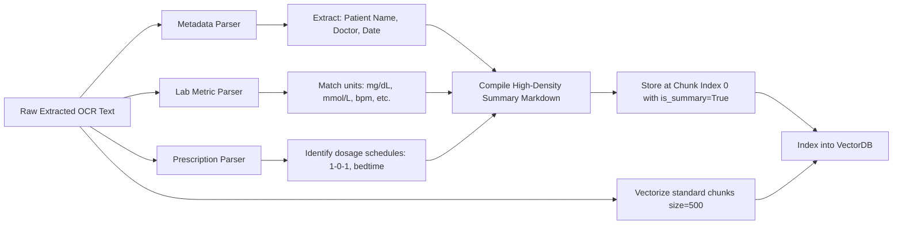

# 🩺 Dr. Aria — Advanced Personal Medical Assistant (Health AI v3.2)

Welcome to the **Health AI v3.2** repository. This project delivers **Dr. Aria**, an offline-first, stateless personal medical assistant designed for secure local deployment or production execution.

---

## 📁 Repository Structure

Below is an overview of the core packages and modules configured in the workspace:

```tree
├── health_ai/                      # Core backend application
│   ├── api/
│   │   ├── server.py               # FastAPI server & endpoint orchestration
│   │   └── main.py                 # Startup script for launching the FastAPI server
│   ├── config/
│   │   └── settings.py             # central configurations, path bounds, & limits
│   ├── core/
│   │   ├── character.py            # Dr. Aria system prompts, intent filters & empathy rules
│   │   ├── exceptions.py           # Custom application exception classes
│   │   ├── logger.py               # Rotating logger engine (max 10MB, 5 backups)
│   │   └── safety.py               # Emergency symptom matching, disclaimers & prompt guards
│   ├── embeddings/
│   │   └── embedder.py             # Singleton interface for BGE embedding model
│   ├── external/
│   │   └── drug_api.py             # RxNorm & DailyMed drug lookup utilities
│   ├── model/
│   │   ├── llm_loader.py           # Singleton LLM loader (supports split & single GGUFs)
│   │   └── PLACE_MODEL_HERE.txt    # Helper file indicating model directory
│   ├── rag/
│   │   ├── chunker.py              # Word-window text chunker (sliding overlap window)
│   │   ├── context_builder.py      # Context assembler & prompt sanitizer
│   │   └── document_processor.py   # Lab values parser & patient history summaries generator
│   ├── tests/
│   │   ├── fixtures/               # Test documents (PDFs, images, blank sheets)
│   │   ├── generate_ocr_fixtures.py# Script to generate fixtures programmatically
│   │   ├── test_classify_intent.py # Functional test suite for routing & empathy tone
│   │   └── test_ocr_stress.py      # Automated 24-case pipeline stress tests
│   └── utils/
│   │   └── document_reader.py      # Robust digital, scanned, or hybrid PDF/Image reader
│   └── logs/                       # Server log output folder
├── chat.html                       # Modern local developer client UI (Popover, Textarea, Animations)
├── requirements.txt                # System requirements & dependencies
├── upgrades_and_improvements.md   # Compilation of architectural improvements in v3.2
└── README.md                       # This developer documentation
```

---

## 🎨 Visual Pipeline Architecture

### 1. Document Reader Classifier & OCR Pipeline
Uploaded medical PDFs are classified page-by-page and dynamically routed to keep extraction both fast and accurate:



### 2. Hybrid RAG Summarization Data Flow
The extracted text is processed, and key medical stats are indexed dynamically:



---

## ⚙️ Setup & Installation

### 1. Prerequisites
Ensure you have **Python 3.10+** installed, along with local OCR dependencies:
- **Tesseract OCR:** Install the Tesseract binaries on your system and add them to your environment PATH.

### 2. Create Virtual Environment
Set up a python virtual environment in the project directory:

```bash
python -m venv .venv

# On Windows (PowerShell):
.\.venv\Scripts\Activate.ps1

# On macOS/Linux:
source .venv/bin/activate
```

### 3. Install Dependencies
Install all required packages:

```bash
pip install -r requirements.txt
```

### 4. Setup LLM Model
1. Download the Qwen3 30B GGUF model: **`Qwen3-30B-A3B.gguf`**.
2. Place the GGUF file in: `health_ai/model/`
3. Configure the active filename in `health_ai/config/settings.py` via `LLM_MODEL_PATH`.

> [!IMPORTANT]
> The dynamic model loader [llm_loader.py](file:///c:/Users/Zap/UHI_Internship/Health-Digital-Twin-Sunav/healthbot_v3.2/health_ai/model/llm_loader.py) automatically handles both single-file models (like `Qwen3-30B-A3B.gguf`) and split-file model shards (like `qwen2.5-14b-instruct-q5_k_m-00001-of-00003.gguf`). If using split shards, point the model path to shard 1; the loader will locate and verify the other shards.

---

## 🔐 Configuration & Authentication

The FastAPI server enforces authentication on key endpoints (`/upload-and-embed`, `/embed-query`, and `/generate`). 

### 1. Local Development Mode (Bypass Auth)
To test the chatbot locally using the developer UI (`chat.html`) without API keys:
1. Create a `.env` file in the root of the project.
2. Add the following config options:
   ```env
   HEALTH_AI_ALLOW_UNAUTHENTICATED=true
   HEALTH_AI_GPU_LAYERS=0
   ```
   *(Set `HEALTH_AI_GPU_LAYERS=-1` to enable full GPU offload if your system has CUDA support).*

### 2. Production Mode (Strict Auth)
In production, clients must supply credentials:
- **X-API-Key:** Matches the `DIGITAL_TWIN_API_KEY` configured in the server environment.
- **Authorization Bearer Token:** Valid Firebase ID Token verifying the user request.

---

## 🚀 Running the Server & Client UI

### 1. Start the Backend Server
Run the FastAPI application locally:

```bash
python -m health_ai.api.main
```

Once loaded, you can view the automated OpenAPI documentation at: `http://127.0.0.1:8000/docs`

> [!WARNING]
> **Windows AppLocker / WDAC Block:**
> If you get `[WinError 4551] An Application Control policy has blocked this file` targeting `llama.dll` during startup, Windows is preventing DLL execution inside your virtual environment. 
> 
> Move the project folder to a whitelisted system location (such as `C:\Users\Zap\healthbot_v3.2` or your `Desktop`) and run it there to bypass this restriction.

### 2. Launch the Developer UI
Double-click or open `chat.html` in any web browser. 
- Click the **Gear Icon** in the sidebar to open Developer Settings (leveraging the HTML Popover API).
- Write questions in the chat box, which dynamically resizes using CSS `field-sizing: content`.
- Experience smooth sliding entries for message bubles utilizing CSS `@starting-style` declarations.

---

## 🧪 Verification & Automated Testing

Verify your setup by running the test suites:

### 1. Unit & Functional Tests
Verify intent classification and context-aware fallback logic:

```bash
python -m pytest health_ai/tests/
```

### 2. Pipeline Stress Tests
Run the robust **24-case OCR and Document Reader stress test suite** which simulates corrupted files, skewed PDFs, decompression bombs, table parsing, low-contrast scans, rotated documents, and high-concurrency requests:

```bash
python health_ai/tests/test_ocr_stress.py
```
*(All 24 stress test cases must pass cleanly to verify OCR guardrails).*
